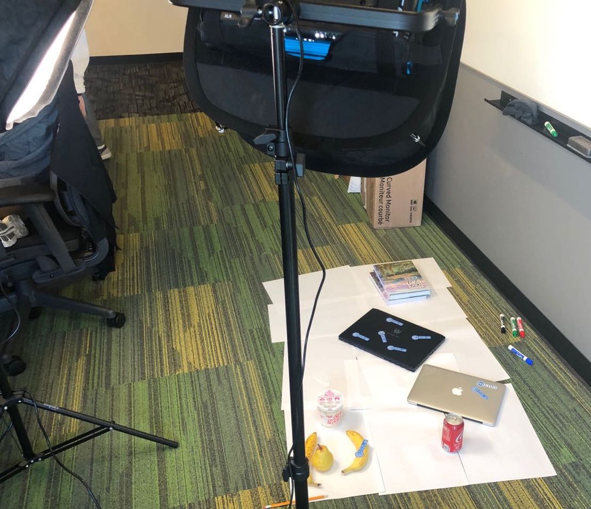

# 动手学深度学习一天训练营

最后更新：|today|

## 实用信息

- 讲师： [李沐](https://github.com/mli)，[何通]( https://github.com/hetong007)
- 助教：[马超](https://github.com/aksnzhy)
- 时间： 9月5号全天
- 地点：[北京长城饭店（朝阳区 东三环北路10号）](https://j.map.baidu.com/39/Smg)
- 注册：[深度学习实训营注册](https://aiprocon.csdn.net/m/topic/ai_procon/ticket)

## 概况

你想了解深度学习但没有数月时间吗？你是刚开始了解机器学习吗？你想构建深度学习模型来识别图片物体？你想使用多个GPU甚至是多台机器来训练吗？如果你是高年级学生，工程师，或者数据科学家，这个课程将适合你。这个课程基于19年我们在加州大学伯克利分校教授的《深度学习导论》，但浓缩进了一天。授课部分有4部分，每部分100分钟。晚上我们将进行Hackathon，使用白天学到的知识来构建实际应用。

1. 深度学习基础
2. 卷积神经网络
3. 计算性能
4. 计算机视觉
5. 训练你的目标检测模型

## 大纲

| Time | Topics |
| --- | --- |
| 9:00---10:40 | [第一部分：深度学习基础](#id5) |
| 10:40---11:00 | 休息 |
| 11:00---12:40 | [第二部分：卷积神经网络](#id6) |
| 12:40---2:00 | 午饭 |
| 2:00---3:40 | [第三部分：性能](#id7) |
| 3:40---4:00 | 休息 |
| 4:00---5:40 | [第四部分：计算机视觉](#id8) |
| 5:40---7:00 | 晚饭 |
| 7:00---12:00 | [第五部分：构建你的物体检测器](#id9) |

### 第一部分：深度学习基础

**幻灯片**: [[keynote]](slides/Part-1.key), [[pdf]](slides/Part-1.pdf)

**记事本**:

1.   [[ipynb]](https://github.com/mli/d2l-1day-notebooks-zh/blob/master/notebooks-1/1-ndarray.ipynb)  [[slides]](https://nbviewer.jupyter.org/format/slides/github/mli/d2l-1day-notebooks-zh/blob/master/notebooks-1/1-ndarray.ipynb#/) 使用 NDArray 进行数据交互
1.   [[ipynb]](https://github.com/mli/d2l-1day-notebooks-zh/blob/master/notebooks-1/2-autograd.ipynb)  [[slides]](https://nbviewer.jupyter.org/format/slides/github/mli/d2l-1day-notebooks-zh/blob/master/notebooks-1/2-autograd.ipynb#/) 自动求导
1.   [[ipynb]](https://github.com/mli/d2l-1day-notebooks-zh/blob/master/notebooks-1/3-linear-regression-scratch.ipynb)  [[slides]](https://nbviewer.jupyter.org/format/slides/github/mli/d2l-1day-notebooks-zh/blob/master/notebooks-1/3-linear-regression-scratch.ipynb#/) 从 0 开始的线性回归
1.   [[ipynb]](https://github.com/mli/d2l-1day-notebooks-zh/blob/master/notebooks-1/4-linear-regression-gluon.ipynb)  [[slides]](https://nbviewer.jupyter.org/format/slides/github/mli/d2l-1day-notebooks-zh/blob/master/notebooks-1/4-linear-regression-gluon.ipynb#/) 线性回归的简洁实现
1.   [[ipynb]](https://github.com/mli/d2l-1day-notebooks-zh/blob/master/notebooks-1/5-fashion-mnist.ipynb)  [[slides]](https://nbviewer.jupyter.org/format/slides/github/mli/d2l-1day-notebooks-zh/blob/master/notebooks-1/5-fashion-mnist.ipynb#/) 图片分类数据 (Fashion-MNIST)
1.   [[ipynb]](https://github.com/mli/d2l-1day-notebooks-zh/blob/master/notebooks-1/6-softmax-regression-scratch.ipynb)  [[slides]](https://nbviewer.jupyter.org/format/slides/github/mli/d2l-1day-notebooks-zh/blob/master/notebooks-1/6-softmax-regression-scratch.ipynb#/) Softmax 回归的从零开始实现
1.   [[ipynb]](https://github.com/mli/d2l-1day-notebooks-zh/blob/master/notebooks-1/7-softmax-regression-gluon.ipynb)  [[slides]](https://nbviewer.jupyter.org/format/slides/github/mli/d2l-1day-notebooks-zh/blob/master/notebooks-1/7-softmax-regression-gluon.ipynb#/) Softmax 回归的简洁实现
1.   [[ipynb]](https://github.com/mli/d2l-1day-notebooks-zh/blob/master/notebooks-1/8-mlp-scratch.ipynb)  [[slides]](https://nbviewer.jupyter.org/format/slides/github/mli/d2l-1day-notebooks-zh/blob/master/notebooks-1/8-mlp-scratch.ipynb#/) 多层感知机的从零开始实现
1.   [[ipynb]](https://github.com/mli/d2l-1day-notebooks-zh/blob/master/notebooks-1/9-mlp-gluon.ipynb)  [[slides]](https://nbviewer.jupyter.org/format/slides/github/mli/d2l-1day-notebooks-zh/blob/master/notebooks-1/9-mlp-gluon.ipynb#/) 多层感知机的简洁实现

### 第二部分：卷积神经网络

**幻灯片**: [[keynote]](slides/Part-2.key), [[pdf]](slides/Part-2.pdf)

**记事本**:

1. [[ipynb]](https://github.com/mli/d2l-1day-notebooks-zh/blob/master/notebooks-2/1-use-gpu.ipynb)  [[slides]](https://nbviewer.jupyter.org/format/slides/github/mli/d2l-1day-notebooks-zh/blob/master/notebooks-2/1-use-gpu.ipynb#/) GPUs
1.  [[ipynb]](https://github.com/mli/d2l-1day-notebooks-zh/blob/master/notebooks-2/2-conv-layer.ipynb)  [[slides]](https://nbviewer.jupyter.org/format/slides/github/mli/d2l-1day-notebooks-zh/blob/master/notebooks-2/2-conv-layer.ipynb#/) 卷积
1.  [[ipynb]](https://github.com/mli/d2l-1day-notebooks-zh/blob/master/notebooks-2/3-pooling.ipynb)  [[slides]](https://nbviewer.jupyter.org/format/slides/github/mli/d2l-1day-notebooks-zh/blob/master/notebooks-2/3-pooling.ipynb#/) 池化层
1.  [[ipynb]](https://github.com/mli/d2l-1day-notebooks-zh/blob/master/notebooks-2/4-lenet.ipynb)  [[slides]](https://nbviewer.jupyter.org/format/slides/github/mli/d2l-1day-notebooks-zh/blob/master/notebooks-2/4-lenet.ipynb#/) 卷积神经网络 (LeNet)
1.  [[ipynb]](https://github.com/mli/d2l-1day-notebooks-zh/blob/master/notebooks-2/5-alexnet.ipynb)  [[slides]](https://nbviewer.jupyter.org/format/slides/github/mli/d2l-1day-notebooks-zh/blob/master/notebooks-2/5-alexnet.ipynb#/) 深度卷积神经网络 (AlexNet)
1.   [[ipynb]](https://github.com/mli/d2l-1day-notebooks-zh/blob/master/notebooks-2/6-vgg.ipynb)  [[slides]](https://nbviewer.jupyter.org/format/slides/github/mli/d2l-1day-notebooks-zh/blob/master/notebooks-2/6-vgg.ipynb#/) 使用重复元素的网络 (VGG)
1.  [[ipynb]](https://github.com/mli/d2l-1day-notebooks-zh/blob/master/notebooks-2/7-googlenet.ipynb)  [[slides]](https://nbviewer.jupyter.org/format/slides/github/mli/d2l-1day-notebooks-zh/blob/master/notebooks-2/7-googlenet.ipynb#/) 含并行连结的网络（(GoogLeNet)
1.  [[ipynb]](https://github.com/mli/d2l-1day-notebooks-zh/blob/master/notebooks-2/8-resnet.ipynb)  [[slides]](https://nbviewer.jupyter.org/format/slides/github/mli/d2l-1day-notebooks-zh/blob/master/notebooks-2/8-resnet.ipynb#/) 残差网络（(ResNet)

### 第三部分：性能

**幻灯片**: [[keynote]](slides/Part-3.key), [[pdf]](slides/Part-3.pdf)

**记事本**:

1. [[ipynb]](https://github.com/mli/d2l-1day-notebooks-zh/blob/master/notebooks-3/1-hybridize.ipynb)  [[slides]](https://nbviewer.jupyter.org/format/slides/github/mli/d2l-1day-notebooks-zh/blob/master/notebooks-3/1-hybridize.ipynb#/) 命令式和符号式混合编程
1. [[ipynb]](https://github.com/mli/d2l-1day-notebooks-zh/blob/master/notebooks-3/2-multiple-gpus.ipynb)  [[slides]](https://nbviewer.jupyter.org/format/slides/github/mli/d2l-1day-notebooks-zh/blob/master/notebooks-3/2-multiple-gpus.ipynb#/) 多 GPU 训练

### 第四部分：计算机视觉

**幻灯片：** [keynote](slides/Part-4.key), [[pdf]](slides/Part-4.pdf)

**记事本：**

1. ​                            [[ipynb]](https://github.com/mli/d2l-1day-notebooks-zh/blob/master/notebooks-4/1-fine-tuning.ipynb)  [[slides]](https://nbviewer.jupyter.org/format/slides/github/mli/d2l-1day-notebooks-zh/blob/master/notebooks-4/1-fine-tuning.ipynb#/) 微调
2. ​                            [[ipynb]](https://github.com/mli/d2l-1day-notebooks-zh/blob/master/notebooks-4/2-bboxes-and-anchor-boxes.ipynb)  [[slides]](https://nbviewer.jupyter.org/format/slides/github/mli/d2l-1day-notebooks-zh/blob/master/notebooks-4/2-bboxes-and-anchor-boxes.ipynb#/) 边界框与锚框

### 第五部分：构建你的物体检测器

在这一部分里，我们要求大家组成3到5人一组的团队，然后在规定时间内训练出一个物体检测器，最后分享每个组的心得。我们将奖励最优秀的团队签名版精装书。

这个部分将跟大多物体检测比赛不一样。通常它们提供数据，大家一起比拼模型精度。在这里，我们只提供测试数据集。我们要求你现场采集数据来训练你的检测器。我们将提供用于识别的物体供大家拍摄，但你需要处理现场背景、光照、角度、甚至是物体细节跟测试集不一致的情况。例如下面是我们拍摄测试集的场景之一：

:width:`400px`

这个项目里我们将体验将机器学习模型部署到实际场景中遇到的两大困难：

1. 如何采集并标注数据
2. 如何处理上线后用户数据跟训练数据不一致，这个称之为covariate shift。

为此，我们建议你：

1. 提前认识人来一起组队
2. 带上你的电脑。我们将提供云上的GPU实例，但你需要用你的电脑连上去
3. 带上你的手机，或者是照相机，确保能方便导入照片到你电脑
